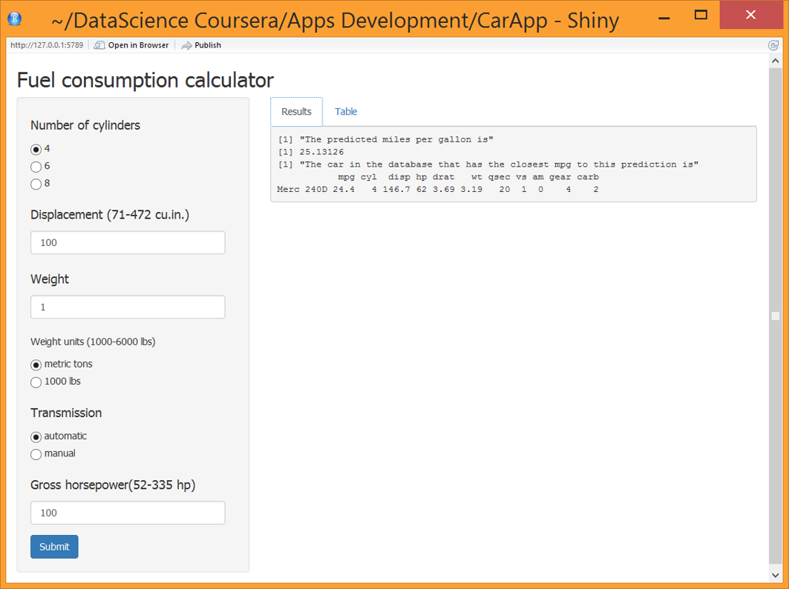

Fuel Consumption Calculator
========================================================
author: Carolina E 
date: Developing Data Products Session July 04 - August 08

========================================================
# Introduction


The Fuel Consumption Calculator uses a linear regression model predict to the mileage per gallon based on the data extracted by Henderson and Velleman from the 1974 Motor Trend US magazine. 

Source : Henderson and Velleman (1981), Building multiple regression models interactively. Biometrics, 37, 391-411.

To access to the app, click in the next link:
<https://caritoe.shinyapps.io/CarApp/>

and for the Github repository with the code of the application:
<https://github.com/CaritoE/DevelopingDataProducts>

========================================================
## Details

The linear model is 

 $$mpg = 42.099244 - 1.807710 * cyl - 0.056428 * disp - 2.354254 * wt * wtunits + 6.510337 * am$$
       $$- 0.018469 * hp + 0.007357 * cyl * disp - 2.135062 * wt * wtunits * am$$

where 

- mpg is miles per gallon
- cyl is number of cylinders
- disp is displacement
- wt is weight
- wtunits is the units of the weight
- am is the type of transmission
- hp is the horsepower

========================================================
# App details 





***
## - Tab 1
 

The panel on the left of the app contains the inputs to select the desired features and a submit button to stimate the fuel consumption.

The first tab shows the results of the prediction model based on the features.

========================================================
# App details

## - Tab 2

The second tab show a table with the data used for the predictions


```
                   mpg cyl disp  hp drat    wt  qsec vs am gear carb
Mazda RX4         21.0   6  160 110 3.90 2.620 16.46  0  1    4    4
Mazda RX4 Wag     21.0   6  160 110 3.90 2.875 17.02  0  1    4    4
Datsun 710        22.8   4  108  93 3.85 2.320 18.61  1  1    4    1
Hornet 4 Drive    21.4   6  258 110 3.08 3.215 19.44  1  0    3    1
Hornet Sportabout 18.7   8  360 175 3.15 3.440 17.02  0  0    3    2
Valiant           18.1   6  225 105 2.76 3.460 20.22  1  0    3    1
```
